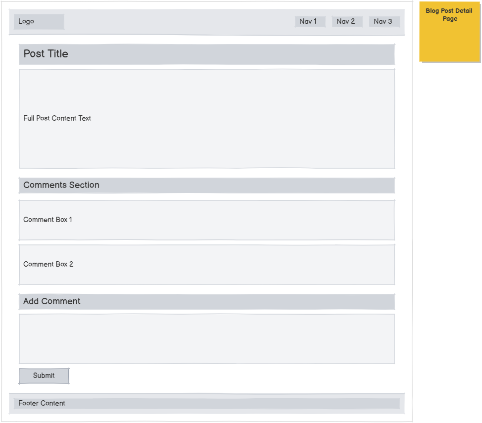
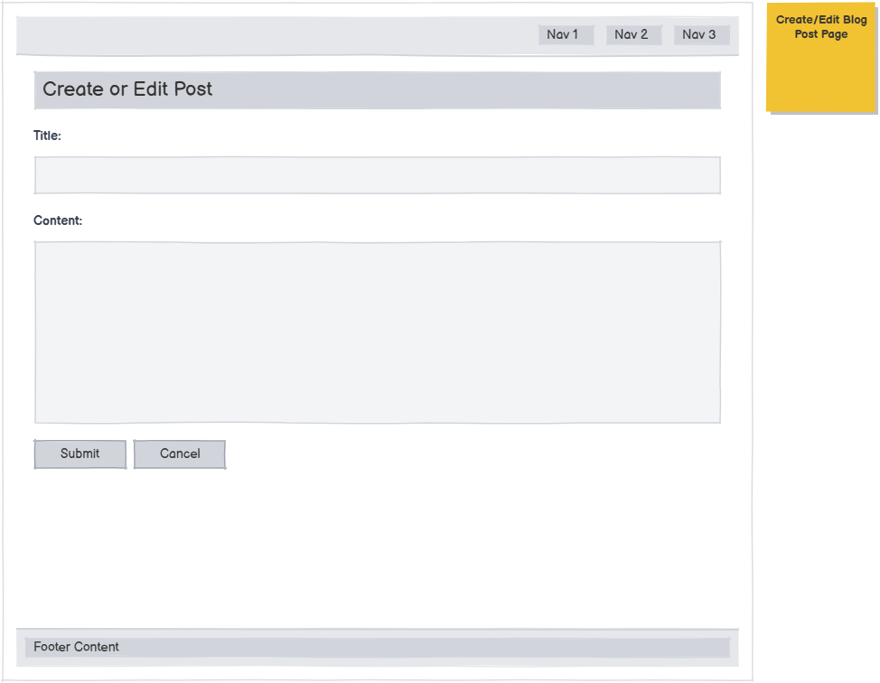
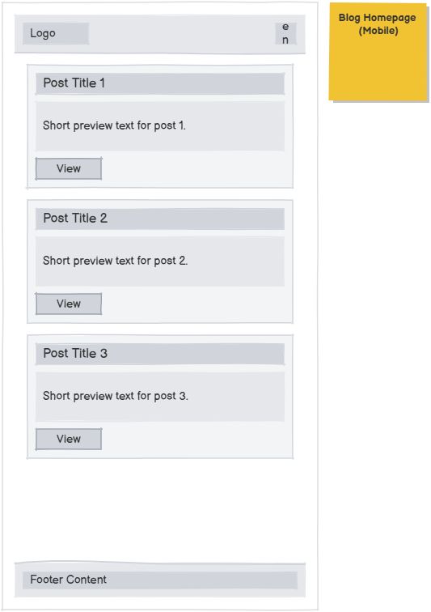

# The Django Blog – Discussion Forum Application

A full-stack Django web application that allows users to create posts, view discussions, and manage comments. The project demonstrates full CRUD functionality, database integration, responsive design, and deployment readiness.

---

## Live Site
https://thedjangoblog-5115dd98e142.herokuapp.com/blog/

## Repository
https://github.com/chazeldred55-code/thedjangoblog

---

## Table of Contents

1. [Project Overview](#1-project-overview)
1.5. [WireFrame](#1.5-wire-frame) 
3. [User Experience (UX)](#2-user-experience-ux)  
4. [User Stories](#3-user-stories)  
5. [Features](#4-features)  
6. [CRUD Functionality](#5-crud-functionality)  
7. [Data Model](#6-data-model)  
8. [Screenshots](#7-screenshots)  
9. [Responsive Design](#8-responsive-design)  
10. [Technologies Used](#9-technologies-used)  
11. [Testing](#10-testing)  
12. [Bugs & Fixes](#11-bugs--fixes)  
13. [Deployment](#12-deployment)  
14. [Security & Defensive Programming](#13-security--defensive-programming)  
15. [Future Improvements](#14-future-improvements)  
16. [Credits](#15-credits)  

---

## 1. Project Overview

The Django Blog is a Reddit-style discussion platform where users can:

- View all blog posts  
- Read post details  
- Add comments  
- Edit and delete content  
- Receive feedback messages after actions  

The application uses Django’s Model-Template-View architecture and a relational database to store dynamic content.

## 1.5. Wireframe

## Wireframes

Wireframes were created during the planning stage to define layout structure, content hierarchy, and user flow before development began.

The design focused on:
- Clear navigation
- Logical content structure
- Simple user interaction
- Mobile-first responsive layout

### Homepage Wireframe

### Post Detail Wireframe

### Create / Edit Form Wireframe

### Mobile Layout Wireframe

---

## 2. User Experience (UX)

### Design Goals
- Simple and intuitive navigation  
- Clear visual hierarchy for posts and comments  
- Immediate feedback for user actions  
- Responsive layout for all devices  

### User Value
- Quick browsing of discussions  
- Easy interaction through comments  
- Clear confirmation of successful or failed actions  
- Mobile-friendly experience  

---

## 3. User Stories

### Core Functionality
- As a user, I want to view all posts so I can browse discussions.  
- As a user, I want to open a post to read details and comments.  
- As a user, I want to add a comment to participate.  
- As a user, I want to edit my content.  
- As a user, I want to delete content I no longer want.  
- As a user, I want confirmation messages after actions.  

### UX
- As a user, I want the site to work on mobile and desktop.  
- As a user, I want clear layouts and readable content.  

---

## 4. Features

### Implemented
- View all posts  
- View post details  
- Create posts  
- Add comments  
- Edit comments/posts  
- Delete content with confirmation  
- Success and error messages  
- Database-driven content  
- Responsive layout  

### Planned
- User authentication  
- User profiles  
- Categories or tags  
- Post voting  
- Search functionality  
- Pagination  

---

## 5. CRUD Functionality

| Operation | Description |
|---|---|
| Create | Users can add posts and comments |
| Read | Users can view posts and details |
| Update | Users can edit content |
| Delete | Users can remove content with confirmation |

All changes update the database immediately and reflect in the UI.

---

## 6. Data Model

### Post
- Title  
- Content  
- Author  
- Created date  

### Comment
- Linked to Post (ForeignKey)  
- Content  
- Created date  

**Relationship:** One Post → Many Comments

---

## 7. Screenshots

### View Posts – Homepage

### Posts Loaded

---

### Comment Workflow

**Add Comment**  

**Submit Comment**  

**Approve Comment**  

**Modify Comment**  

**Delete Comment**  

**Success Message**  

**Validation Feedback**  

**Delete Confirmation**  

---

## 8. Responsive Design

### Desktop

### Tablet

### Mobile

The layout adapts across screen sizes to maintain usability and readability.

---

## 9. Technologies Used

### Backend
- Python  
- Django  

### Frontend
- HTML5  
- CSS3  

### Database
- SQLite (development)  

### Tools
- Git  
- GitHub  
- Heroku  

---

## 10. Testing

### Manual Testing

| Feature | Expected Result | Outcome |
|---|---|---|
| Load homepage | Posts displayed | Pass |
| Create post | Post saved | Pass |
| Submit empty form | Validation error | Pass |
| Edit content | Changes saved | Pass |
| Delete content | Removed after confirmation | Pass |
| Add comment | Appears on post | Pass |
| Responsive layout | Adapts to screen | Pass |

### Validation
- Django form validation enforced  
- Required fields checked  
- Error messages displayed clearly  

### Code Validation
- Python: PEP8 compliant  
- HTML: W3C validated  
- CSS: Jigsaw validated  

---

## 11. Bugs & Fixes

All bugs identified during development were resolved.  
No known outstanding issues.

---

## 12. Deployment

### Local Setup

git clone https://github.com/chazeldred55-code/thedjangoblog.git
cd thedjangoblog
pip install -r requirements.txt
python manage.py migrate
python manage.py runserver

## 13. Security & Defensive Programming

The application follows several defensive programming and security practices:

- **Django form validation** is used to validate all user inputs.
- **CSRF protection** is enabled for all POST requests.
- **Required fields** prevent empty or invalid submissions.
- **Error handling** ensures the application fails gracefully without crashing.
- **User feedback messages** inform users when actions succeed or fail.
- **Delete confirmation prompts** prevent accidental data loss.
- **Environment variables** are used to store sensitive data such as:
  - SECRET_KEY
  - DEBUG setting
  - Database configuration (production)

Future security improvements:
- User authentication and author-based permissions
- Restrict edit/delete actions to content owners
- Admin moderation controls

---

## 14. Future Improvements

Planned enhancements to extend functionality and improve user experience:

- User authentication (login, logout, registration)
- User profiles
- Restrict editing and deleting to the post/comment author
- Categories or tags for posts
- Search and filtering functionality
- Pagination for large numbers of posts
- Rich text or Markdown editor
- Comment moderation tools
- Post voting system (upvote/downvote)

---

## 15. Credits

- Built with **Python** and **Django**
- Frontend developed using **HTML5** and **CSS3**
- Version control and project hosting via **GitHub**
- Deployment configured for **Heroku**
- Project inspired by discussion platforms such as Reddit
- Screenshots hosted using GitHub user attachments
