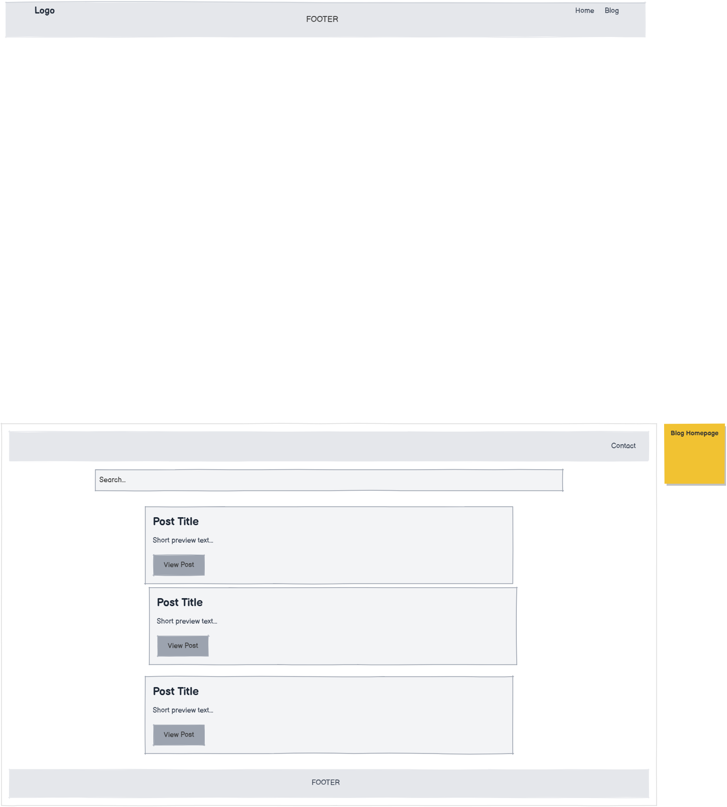
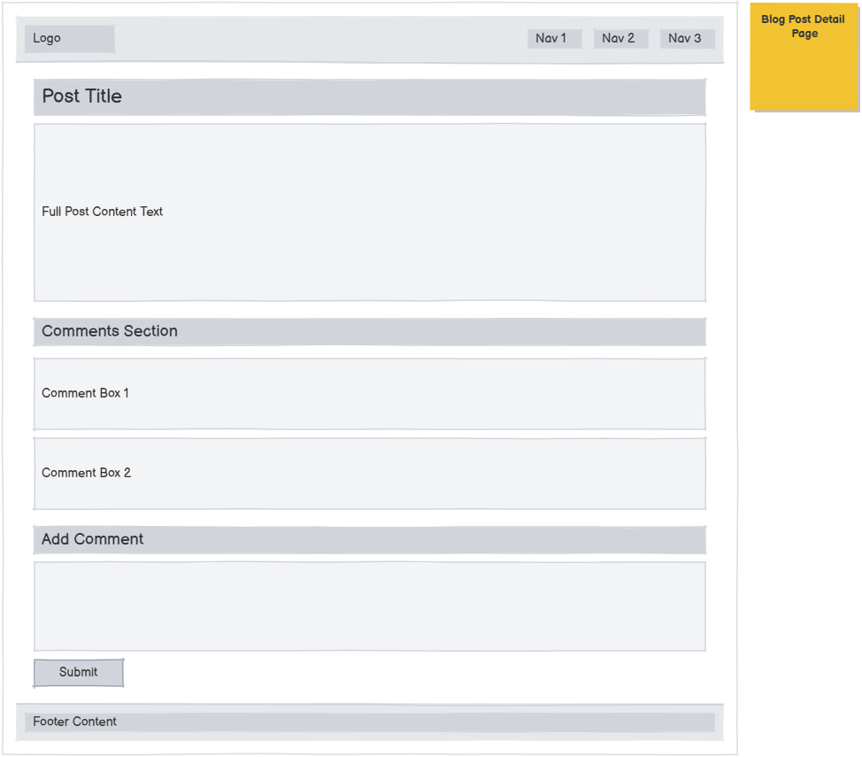
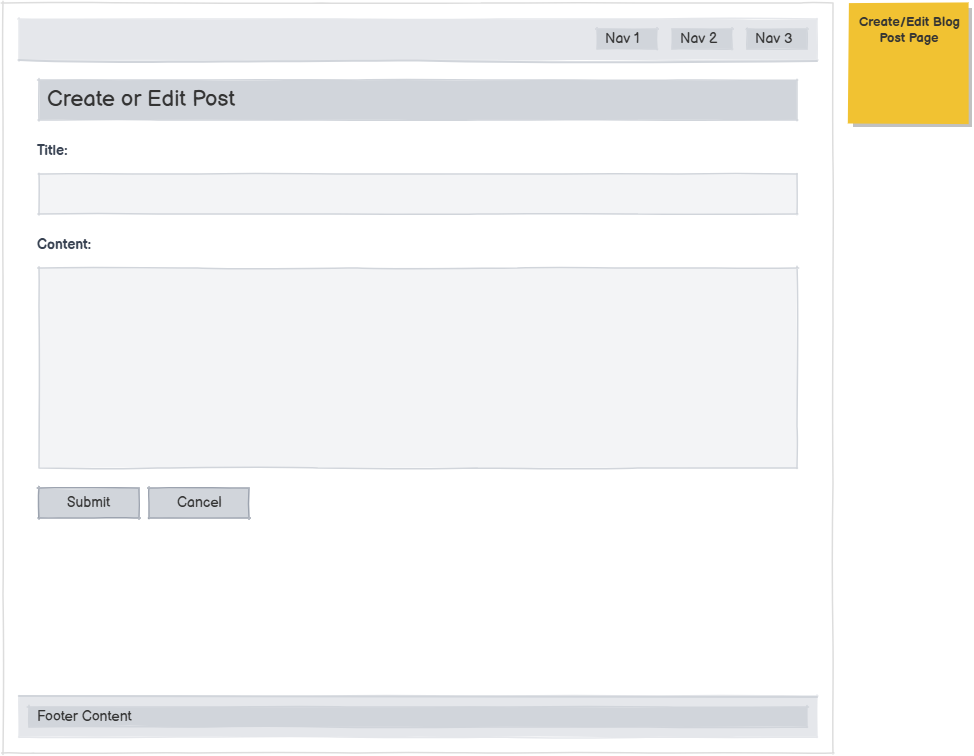
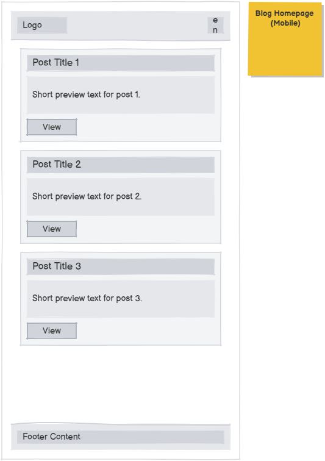

# The Django Blog – Discussion Forum Application

A full-stack Django web application that allows users to view posts and participate in discussions through comments.

---

## Live Site
https://thedjangoblog-5115dd98e142.herokuapp.com/blog/

### Open in Incognito mode

## Repository
https://github.com/chazeldred55-code/thedjangoblog

---

## Table of Contents

1. [Project Overview](#1-project-overview)
2. [WireFrame](#2-wire-frame) 
3. [User Experience (UX)](#3-user-experience-ux)  
4. [User Stories](#4-user-stories)  
5. [Features](#5-features)  
6. [CRUD Functionality](#6-crud-functionality)  
7. [Data Model](#7-data-model)    
9. [Responsive Design](#9-responsive-design)  
10. [Technologies Used](#10-technologies-used)  
11. [Testing](#11-testing)  
12. [Bugs & Fixes](#12-bugs--fixes)  
13. [Deployment](#13-deployment)  
14. [Security & Defensive Programming](#14-security--defensive-programming)  
15. [Future Improvements](#15-future-improvements)  
16. [Credits](#16-credits)  


---

## 1. Project Overview

The Django Blog is a Reddit-style discussion platform where users can:

- View all blog posts  
- Read post details  
- Add comments  
- Edit and delete comments  
- Receive feedback messages after actions  

The application uses Django’s Model-Template-View architecture and a relational database to store dynamic content.
## System Behaviour

- Posts are managed via the Django admin interface
- Users interact with the system through authenticated comments
- Ownership checks ensure users can only modify their own data
- All write operations are validated and protected by authentication


## 2 Wireframe

## Wireframes

Wireframes were created during the planning stage to define layout structure, content hierarchy, and user flow before development began.

The design focused on:
- Clear navigation
- Logical content structure
- Simple user interaction
- Mobile-first responsive layout

### Homepage Wireframe


### Post Detail Wireframe


### Create / Edit Form Wireframe


### Mobile Layout Wireframe

---

## 3. User Experience (UX)

### Design Goals
- Simple and intuitive navigation  
- Clear visual hierarchy for posts and comments  
- Immediate feedback for user actions  
- Responsive layout for all devices  

### User Value
- Quick browsing of discussions  
- Easy interaction through comments  
- Clear confirmation of successful or failed actions  
- Mobile-friendly experience  

---

## 4. User Stories

### Core Functionality
- As a user, I want to view all posts so I can browse discussions.  
- As a user, I want to open a post to read details and comments.  
- As a user, I want to add a comment to participate.     
- As a user, I want confirmation messages after actions.  

### UX
- As a user, I want the site to work on mobile and desktop.  
- As a user, I want clear layouts and readable content.  

---

## 5. Features

### Implemented
- View all posts  
- View post details    
- Add comments  
- Edit comments/posts  
- Delete comments with confirmation  
- Success and error messages  
- Database-driven content  
- Responsive layout  

- User authentication (login, register, logout via django-allauth)
- Auth-protected comment submission
- Users can only edit/delete their own comments

---

## 6. CRUD Functionality

| Operation | Description |
|---|---|
| Create | Users can add posts and comments |
|edit     | Users can edit and deleted comments |
| Read | Users can view posts and details |

All changes update the database immediately and reflect in the UI.

---

## 7. Data Model
[ERD Diagram]

The ERD above illustrates the relationships between models. Field types and constraints are detailed in the sections below.
Category

The Category model is used to organise posts into groups.

name — CharField (max_length=100, unique=True)
description — TextField (blank=True)

A Category can contain multiple Posts (One-to-Many).

Post

The Post model represents user-created content.

title — CharField (max_length=200, unique=True)
slug — SlugField (unique=True)
author — ForeignKey to User (on_delete=CASCADE)
category — ForeignKey to Category
featured_image — CloudinaryField (default placeholder)
content — TextField
excerpt — TextField (blank=True)
status — IntegerField (Draft=0, Published=1)
created_on — DateTimeField (auto_now_add=True)
updated_on — DateTimeField (auto_now=True)

Each Post belongs to one Category and one User, and can have many Comments and Votes.

Comment

The Comment model enables user interaction and threaded replies.

post — ForeignKey to Post
author — ForeignKey to User
body — TextField
approved — BooleanField (default=False)
created_on — DateTimeField (auto_now_add=True)
parent — ForeignKey to self (null=True, blank=True)

This supports:

Post → Comments (One-to-Many)
Comment → Replies (self-referencing)
Vote

The Vote model tracks upvotes and downvotes.

user — ForeignKey to User
post — ForeignKey to Post
value — SmallIntegerField (1 = upvote, -1 = downvote)

Constraint:

A user can only vote once per post (unique_together)
Profile

The Profile model extends the User model.

user — OneToOneField to User
avatar_url — CharField (max_length=255, default image path)
bio — TextField (blank=True)

Each User has exactly one Profile.

Relationships Summary
User → Post (One-to-Many)
User → Comment (One-to-Many)
User → Vote (One-to-Many)
User → Profile (One-to-One)
Category → Post (One-to-Many)
Post → Comment (One-to-Many)
Post → Vote (One-to-Many)
Comment → Comment (threaded replies)

---

### 8. Screenshots

### View Posts – Homepage


### Posts Loaded


---

### Comment Workflow
**cant comment without loggin in**


**Add Comment**  


**Submit Comment**  


**Approve Comment**  


**Modify Comment**  

**Modify Comment as a User**

**Delete Comment as a User** 


**Delete Comment**  


**Success Message**  


**Validation Feedback**  


**Delete Confirmation**  


---

## 9. Responsive Design

### Desktop


### Tablet


### Mobile


The layout adapts across screen sizes to maintain usability and readability.

---

## 10. Technologies Used

### Backend
- Python  
- Django  

### Frontend
- HTML5  
- CSS3  

### Database
- SQLite (development)  
- PostgreSQL (production via Heroku)
### Tools
- Git  
- GitHub  
- Heroku  

---

## 11. Testing

### Manual Testing

| Feature | Expected Result | Outcome |
|---|---|---|
| Load homepage | Posts displayed | Pass |
| Create post | Post saved | Pass |
| Submit empty form | Validation error | Pass |
| Edit content | Changes saved | Pass |
| Delete content | Removed after confirmation | Pass |
| Add comment | Appears on post | Pass |
| Responsive layout | Adapts to screen | Pass |

### Lighthouse Tested
#### Desktop

#### Mobile


### Validation
- Django form validation enforced  
- Required fields checked  
- Error messages displayed clearly  

### Code Validation
- Python: PEP8 compliant  
- HTML: W3C validated  
- CSS: Jigsaw validated  
### Code Validation

#### PEP8 Compliance (Python)

All Python code was validated using `pycodestyle`.

Command used:
pycodestyle . --exclude=.venv,migrations,__pycache__

This ensures only custom project files were checked, excluding third-party libraries and auto-generated Django files.

Result:
- No errors or warnings found

(Screenshot below)


#### W3C HTML Validation

All pages were validated using the W3C HTML Validator.

| Page | Result |
|------|--------|
| Post List | No errors |
| Post Detail | No errors |
| Create/Edit | No errors |
| Login/Register | No errors |

(Screenshot below)

https://validator.w3.org/
Post List:


Post Detail:


Edit / Delete Comment:


Login: 

Sign up:


https://jigsaw.w3.org/css-validator/

## CSS Validation

The CSS was validated using the W3C CSS Validator.

Errors and warnings shown are related to Bootstrap 5.3, which is included via CDN. 
These occur because the validator does not fully support modern CSS features such as variables and advanced selectors used by Bootstrap.

All custom CSS written for this project validates successfully with no errors.


## 12. Bugs & Fixes

## 12. Bugs & Fixes

During development, several issues were encountered and resolved. These are documented below to demonstrate the debugging and problem-solving process.

| Bug Description | Where Found | Root Cause | Fix Applied |
|----------------|------------|-----------|------------|
| Comments could be submitted without login | Testing | No authentication check on comment submission view | Added login restriction to ensure only authenticated users can submit comments |
| HTML validation errors on forms | Validation phase | Incorrect HTML structure and missing attributes | Fixed template structure and corrected invalid attributes |
| CSS layout breaking on mobile devices | Manual testing | Fixed-width elements and lack of responsive design | Implemented responsive CSS and Bootstrap grid system |
| Migration errors during development | Development | Changes to models after initial migrations | Re-ran migrations and ensured models and database schema were in sync |
| Deployment error on Heroku | Deployment | Missing or incorrect environment variables (e.g. DATABASE_URL) | Configured Heroku Config Vars correctly and redeployed application |
| Duplicate voting issue | Testing | No constraint preventing multiple votes per user | Added `unique_together` constraint in Vote model |
| Images not displaying correctly | Testing | Incorrect Cloudinary configuration | Fixed Cloudinary settings and ensured proper media handling |
| URL routing errors (404 pages) | Development | Incorrect URL patterns or missing routes | Updated urls.py and ensured all routes were correctly defined |

### Summary

All identified bugs were resolved through systematic testing, debugging, and iterative improvements. No critical issues remain that affect core functionality.

## 13. Deployment

### Local Setup

To run the project locally:

```
git clone https://github.com/chazeldred55-code/thedjangoblog.git
cd thedjangoblog
pip install -r requirements.txt
python manage.py migrate
python manage.py runserver
```

---

### Heroku Deployment

The application was deployed using Heroku with the following steps:

1. Create a new Heroku app  
2. Connect the GitHub repository to Heroku  
3. Add required Config Vars:
   - SECRET_KEY
   - DATABASE_URL
   - CLOUDINARY_URL
   - DEBUG=False  
4. Add the Heroku Postgres add-on  
5. Deploy the main branch  
6. Run migrations:

```
heroku run python manage.py migrate
```

7. Collect static files:

```
heroku run python manage.py collectstatic
```

8. Open the deployed application  

---

### PostgreSQL Database (Production)

In development, the project uses SQLite as the default database due to its simplicity.

In production, PostgreSQL is used via Heroku.

The application switches automatically using the `DATABASE_URL` environment variable and `dj-database-url`.

In `settings.py`:

```python
DATABASE_URL = config("DATABASE_URL", default="")

if DATABASE_URL:
    DATABASES = {
        "default": dj_database_url.parse(
            DATABASE_URL,
            conn_max_age=600,
            ssl_require=True,
        )
    }
else:
    DATABASES = {
        "default": {
            "ENGINE": "django.db.backends.sqlite3",
            "NAME": BASE_DIR / "db.sqlite3",
        }
    }
```

This ensures:
- SQLite is used locally  
- PostgreSQL is used in production  

---

### Environment Variables

Sensitive data is stored using environment variables.

A `.env` file is used locally and excluded via `.gitignore`.

Example:

```
SECRET_KEY=your_secret_key
DEBUG=True
DATABASE_URL=your_database_url
CLOUDINARY_URL=your_cloudinary_url
SENDGRID_API_KEY=your_sendgrid_key
```

---

## 14. Security & Defensive Programming

- Environment variables protect sensitive data  
- `.env` is not committed to the repository  
- DEBUG is False in production  
- CSRF protection is enabled  
- Django form validation is enforced  
- Error handling prevents crashes  
- Users receive feedback messages  
- Delete confirmations prevent mistakes  

### Access Control

- Only logged-in users can create/edit/delete  
- Users can only modify their own content  
### Credential Management

During development, environment variables were accidentally committed to version control.  
These credentials were immediately revoked and replaced.  

All sensitive data is now managed securely via environment variables and excluded from version control using `.gitignore`.

A full-stack Django web application that allows users to view posts and participate in discussions through comments.

## 15. Future Improvements

- User authentication enhancements  
- User profiles  
- Permissions for content ownership  
- Categories/tags  
- Search functionality  
- Pagination  
- Rich text editor  
- Comment moderation  
- Voting system  

---

## 16. Credits

- Built with **Python** and **Django**  
- HTML5 and CSS3 frontend  
- GitHub for version control  
- Heroku deployment  
- Inspired by Reddit-style platforms  
Screenshots hosted using GitHub user attachments
